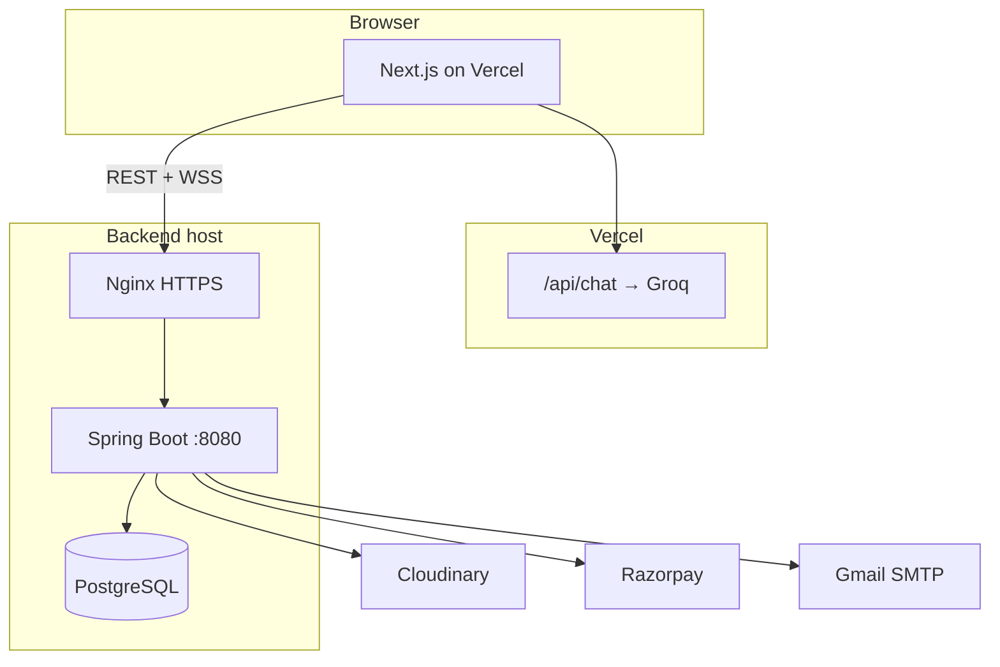

# NerdsOnCall

**Real-time doubt-solving — students, tutors, live video, and instant help.**

<p align="center">
  <a href="https://nerds-on-call.vercel.app/"><strong>Live app</strong></a>
  &nbsp;·&nbsp;
  <a href="https://nerdsoncall-api.shivam.app/health"><strong>API health</strong></a>
  &nbsp;·&nbsp;
  <a href="#quick-start">Run locally</a>
  &nbsp;·&nbsp;
  <a href="#deployment">Deployment</a>
</p>

<p align="center">
  
  
  
  
  
</p>

---

## What is this?

NerdsOnCall connects **students** with **tutors** for:

- Live **1:1 video** (WebRTC)
- Shared **whiteboard** and **screen share**
- **Doubts**, public **Q&A**, and **subscriptions** (Razorpay, INR)
- **AI study assistant** (Groq, server-side on the frontend)

### Features

- Live video calls (WebRTC, peer-to-peer signalling via backend WebSockets)
- Real-time whiteboard / canvas sync
- Screen sharing
- Tutor online status and matching
- Student doubts and tutor solve flow
- Community questions board with video solutions
- Subscription plans (Razorpay Checkout)
- PDF receipts by email on purchase
- Media uploads (Cloudinary)

---

## Live URLs

| Service | URL | Role |
| --- | --- | --- |
| **Frontend** | [https://nerds-on-call.vercel.app/](https://nerds-on-call.vercel.app/) | Next.js app (Vercel) |
| **Backend API** | [https://nerdsoncall-api.shivam.app/](https://nerdsoncall-api.shivam.app/) | Spring Boot REST + WebSockets |
| **Health** | [https://nerdsoncall-api.shivam.app/health](https://nerdsoncall-api.shivam.app/health) | Liveness |
| **DB health** | [https://nerdsoncall-api.shivam.app/health/db](https://nerdsoncall-api.shivam.app/health/db) | PostgreSQL check |

The frontend calls the API with `NEXT_PUBLIC_API_URL`. WebSockets use the same host with `wss://` (derived from that URL).

---

## Architecture



## Tech stack

### Backend (`Server/`)

| Layer | Technology |
| --- | --- |
| Runtime | Java 17, Spring Boot 3.2 |
| API | Spring Web, Spring Security, JWT |
| Data | Spring Data JPA, **PostgreSQL** |
| Real-time | Native WebSockets (`/ws/webrtc`, `/ws/session`) |
| Payments | Razorpay Java SDK |
| Media | Cloudinary SDK |
| Email / PDF | Spring Mail (SMTP), iText 7 |
| Config | `Server/.env` via `spring-dotenv` |

### Frontend (`Client/`)

| Layer | Technology |
| --- | --- |
| Framework | **Next.js 15.5** (App Router), React 18, TypeScript |
| Styling | Tailwind CSS v4 |
| Data | TanStack Query v5, Axios, React Context |
| Real-time | Native `WebSocket` + browser WebRTC |
| UI | Radix primitives, `lucide-react`, `react-hot-toast` |
| AI chat | Groq `llama-3.1-8b-instant` in `app/api/chat/route.ts` only |
| Payments | Razorpay Checkout (script tag, no Stripe) |

**Not used:** Socket.IO, STOMP, Supabase, OpenAI, Gemini, Stripe, MySQL, MongoDB.

---

## Quick start

### Prerequisites

- Java 17+, Maven 3.9+
- Node.js 18+
- PostgreSQL 14+
- Accounts: [Razorpay](https://razorpay.com/), [Cloudinary](https://cloudinary.com/), Gmail app password, [Groq](https://console.groq.com/keys) (free)

### 1. Backend

```bash
cd Server
# Copy and edit env — see Server/.env.example
mvn spring-boot:run
```

→ [http://localhost:8080](http://localhost:8080) · [http://localhost:8080/health](http://localhost:8080/health)

### 2. Frontend

```bash
cd Client
npm install
# Set NEXT_PUBLIC_API_URL=http://localhost:8080 and GROQ_API_KEY in .env
npm run dev
```

→ [http://localhost:3000](http://localhost:3000)

### Environment variables

**Backend** (`Server/.env`):

| Variable | Purpose |
| --- | --- |
| `PORT` | Server port (default `8080`) |
| `FRONTEND_URL` | Frontend base URL (password-reset links) |
| `DB_URL`, `DB_USERNAME`, `DB_PASSWORD` | PostgreSQL |
| `JWT_SECRET` | JWT signing (long random string in production) |
| `MAIL_USERNAME`, `MAIL_PASSWORD` | Gmail SMTP |
| `RAZORPAY_KEY_ID`, `RAZORPAY_KEY_SECRET` | Razorpay |
| `CLOUDINARY_CLOUD_NAME`, `CLOUDINARY_API_KEY`, `CLOUDINARY_API_SECRET` | Uploads |

**Frontend** (`Client/.env`):

| Variable | Purpose |
| --- | --- |
| `NEXT_PUBLIC_API_URL` | Backend base URL (no trailing slash) |
| `GROQ_API_KEY` | Server-only; `/api/chat` route |

**Production example:**

```env
# Vercel
NEXT_PUBLIC_API_URL=https://nerdsoncall-api.shivam.app
GROQ_API_KEY=gsk_...

# Backend
FRONTEND_URL=https://nerds-on-call.vercel.app
```

---

## Deployment

| Part | Host | Notes |
| --- | --- | --- |
| Frontend | **Vercel** | Root directory: `Client`. Set env vars in project settings. |
| Backend | **VPS** (e.g. Oracle Always Free) | JAR + systemd + Nginx + Let's Encrypt |
| Database | **PostgreSQL on same VPS** | Not a separate paid DB service |
| AI chat | **Vercel** | Groq key only in Vercel; never exposed to browser |

Backend must be served over **HTTPS** so the Vercel app can call REST and **WSS** without mixed-content errors.

### Smoke test after deploy

1. Open [https://nerds-on-call.vercel.app/](https://nerds-on-call.vercel.app/)
2. Register / log in
3. Confirm network calls go to `https://nerdsoncall-api.shivam.app`
4. Check [https://nerdsoncall-api.shivam.app/health/db](https://nerdsoncall-api.shivam.app/health/db) → `"status":"UP"`
5. Test video call (WebSocket + WebRTC)
6. Test AI chat on `/chat` (Groq via Vercel route)

---

## Project structure

```
NerdsOnCall/
├── Client/                 # Next.js frontend
│   └── README_FRONTEND.md
├── Server/                 # Spring Boot backend
│   └── README_BACKEND.md
└── README.md               # You are here
```

---

## Docs

- [Client/README_FRONTEND.md](Client/README_FRONTEND.md) — routes, hooks, Razorpay, WebSockets
- [Server/README_BACKEND.md](Server/README_BACKEND.md) — REST map, WebSockets, schedulers, schema

---

## Contributing

1. Fork → branch → PR
2. Never commit `.env` files or API keys
3. Run `mvn test` / `npm run build` before pushing

---

<p align="center">
  Built for real-time learning — <a href="https://nerds-on-call.vercel.app/">open the app</a>
</p>
